I build autonomous systems and the infrastructure that keeps them honest. 
Lately that means agentic development: giving agents the memory, tools and guardrails 
to do real work, and the platforms to run it all at scale.

Shipping code since 2011, with backend and platform engineering underneath: Domain-Driven 
Design, CQRS and Event Sourcing; Kubernetes and Docker since 2015; observability to the bone.

Building **[WombatNest](https://wombatnest.com)** and **[Human](https://human.90plabs.com/connect)** at **[90P&nbsp;Labs](https://90plabs.com)** &nbsp;·&nbsp; **[X](https://twitter.com/Jorge__SVQ)**

---

**SELECTED WORK**

**[symfony-7-es-cqrs-boilerplate](https://github.com/jorge07/symfony-7-es-cqrs-boilerplate)** &nbsp; 
Symfony 7 with Domain-Driven Design, CQRS and Event Sourcing.

**[ddd-playground](https://github.com/jorge07/ddd-playground)** &nbsp; 
A reference for Domain-Driven Design in a Symfony project.

**[hollywood](https://github.com/jorge07/hollywood)** &nbsp; 
A modular TypeScript framework for CQRS and clean architecture.

**[alpine-php](https://github.com/jorge07/alpine-php)** &nbsp; 
Multi-arch Alpine PHP Docker images, 5.6 to 8.x.

---

**STACK**

`TypeScript` &nbsp; `Go` &nbsp; `PHP` &nbsp; `Python` &nbsp; `Node.js`

`React` &nbsp; `Next.js` &nbsp; `Tailwind` &nbsp; `shadcn/ui`

`Kubernetes` &nbsp; `Docker` &nbsp; `Terraform` &nbsp; `AWS` &nbsp; `GCP` &nbsp; `Cloudflare`

`PostgreSQL` &nbsp; `Redis` &nbsp; `Kafka` &nbsp; `RabbitMQ` &nbsp; `Elasticsearch`

`Grafana` &nbsp; `Prometheus` &nbsp; `Thanos` &nbsp; `gRPC`

